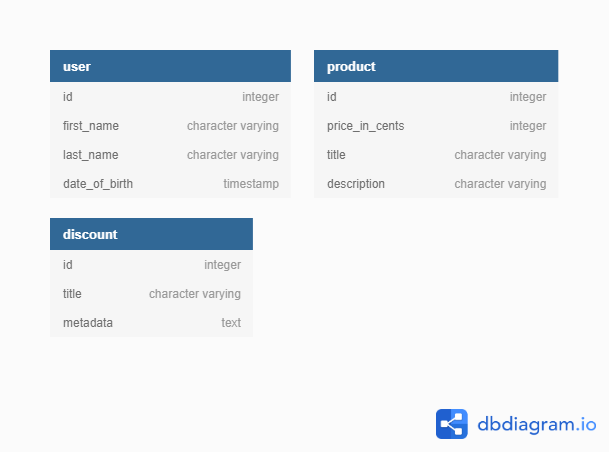
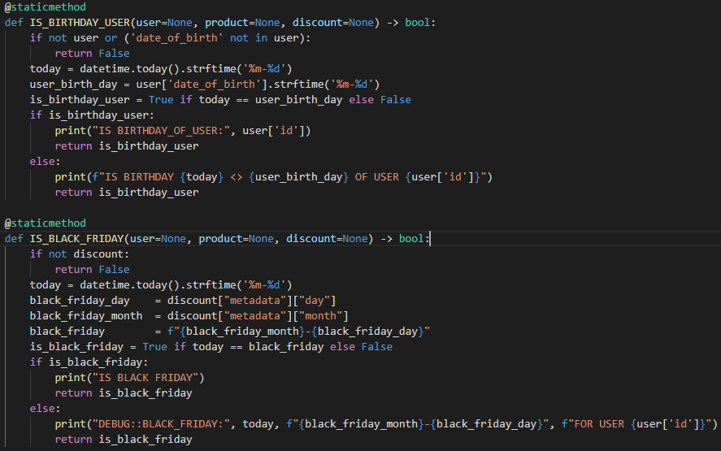

# Hash Challenge
[Challenge Description](https://github.com/hashlab/hiring/blob/master/challenges/pt-br/back-challenge.md)

## Giving permissions to running files
    $ chmox +x run

## Runnig Up Docker-Compose
    $ sh run up
> This command will setup Postgres database, gRPC client (Node Api) and gRPC server (Python Api)

## Stoping Docker-Compose and removing images and containers
    $ sh run down
> This command will down Postgres database, gRPC client (Node Api) and gRPC server (Python Api)

## Running tests
    $ sh run tests

> This command will run python gRPC server tests and node gRPC client tests

## Database Schema

## How Discount is Structured
All Discount types will be recorded on database with an `id`, `title` (the name and type of discount) and a `metadata`.
The metadata will have all required data to apply product discounts. The required metadata properties is
the `percentage` or/and `value_in_cents` and `type`, all aditional properties is specific data for a specific discount type.

## How Discount Works
For every each discount record, there's a method on gRPC Python server to handle it. For each
discount to be created needs one handler method with the same name as `title` field. e.g:
