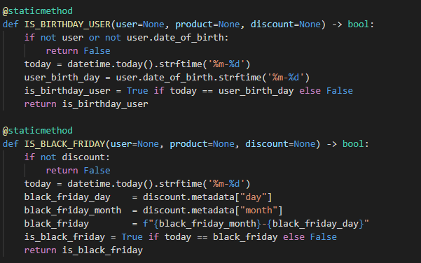

# Hash Challenge
[Challenge Description](https://github.com/hashlab/hiring/blob/master/challenges/pt-br/back-challenge.md)

## Giving permissions to running files
    $ chmox +x run

## Runnig Up Docker-Compose
    $ sh run up
> This command will setup Postgres database, gRPC client (Node Api) and gRPC server (Python Api)

## Stoping Docker-Compose and removing images and containers
    $ sh run down
> This command will down Postgres database, gRPC client (Node Api) and gRPC server (Python Api)

## Running tests
    $ sh run tests

> This command will run python gRPC server tests and node gRPC client tests

## Database Schema

## How Discount is Structured
All Discount types will be recorded on database with an `id`, `title` (the name and type of discount) and a `metadata`.
The metadata will have all required data to apply product discounts. The required metadata properties is
the `percentage` or/and `value_in_cents` and `type` (to set if discount is by percentage or value_in_cents), all aditional properties is specific data for a specific discount type.

## How Discount Works
For every each discount record, there's a method on gRPC Python server to handle it. For each
discount to be created needs one handler method with the same name as `title` field. e.g:

## Endpoints
<b>Base Url:</b> http://localhost:8080
<table>
    <thead>
        <tr>
            <th> Route </th>
            <th> Header </th>
            <th> Query </th>
            <th> Body </th>
            <th> Response </th>
        </tr>
    </thead>
    <tbody>
        <tr>
            <td> /product </td>
            <td>  </td>
            <td> </td>
            <td> </td>
            <td>
                <pre>
                [
                    {
                        "id": 1,
                        "price_in_cents": 7972,
                        "title": "Port - 74 Brights",
                        "description": "description"
                    },
                    ...
                ]
                </pre>
            </td>
        </tr>
        <tr>
            <td> /product </td>
            <td> X-USER-ID </td>
            <td> </td>
            <td> </td>
            <td>
                <pre>
                [
                    {
                        "id": 1,
                        "price_in_cents": 7972,
                        "title": "Port - 74 Brights",
                        "description": "description",
                        "discount": {
                            "percentage": 5,
                            "value_in_cents": 398
                        }
                    },
                    ...
                ]
                </pre>
            </td>
        </tr>
    </tbody>
</table>

## Database Access
Connecting to database by pgadmin \
<b>Url</b>: http://localhost:8282

### Creating server

### Configuring server

